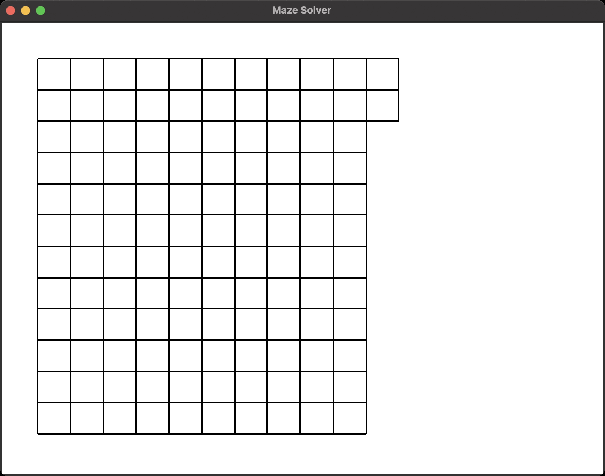

# `Maze Solver`



## Generator And Solver
We'll be building this awesome maze generator and solver! By the end, your code will be rendering mazes like the one above.

Python project using [TKinter](https://tkdocs.com/), from the [boot.dev](https://www.boot.dev) site.

## Virtual Environment for Python
To work with this application please follow the flow for Python Vitrual Environments for [venv](https://docs.python.org/3/library/venv.html#venv-def).

### `0.` - Auto switching to Virtual Environment
The MAC is set-up to autoswitch to the listed virtual environment if on is present. This should be indicated by the presence of a Virtual Environment indicator at the leading characters of the prompt:
```
(venv:venv) SLMaxwell68%:maze_solver[main] >
```

Should the terminal Prompt NOT show that a virtual environment is present:
```
SLMaxwell68%:maze_solver[main] >
```

Follow the needed actions below to activate or create a Virtual Environment.

```zsh
Usage: venv [-acdhir?]

Actions            Alternate Commands:
  -c/--create        venv-create [venv]
  -h/--hidden        venv-create .venv
  -a/--activate      venv-activate
  -d/--deactivate    venv-deactivate
  -i/--install       venv-install
  -r/--remove        venv-remove
  -?/--help          venv-help

Alternate Commands:
  venv-create [venv]   Creates or Rebuilds a fresh virtual python environment
                         with template .gitignore and requirement.txt files.
                         Default folder name visible: venv
  venv-create .venv    Creates or Rebuilds a HIDDEN virtual python environment
                         with template .gitignore and requirement.txt files.
                         FORCING a hidden directory: .venv
  venv-activate        Activates the virtual python environment if present.
  venv-deactivate      De-Activates the currently activated virtual python
                         environment regardless of which directory it is in.
  venv-install         Installs packages listed within the requirements.txt file.
  venv-remove          Removes the local virtual python environment after de-activation.
  venv-help            Displays this help information.
```